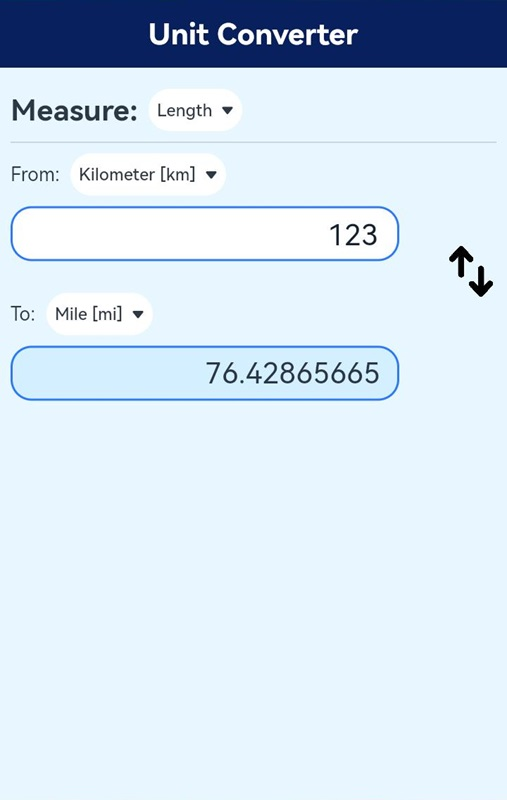

# Unit Converter application
The Unit Converter application is a simple and intuitive tool designed to convert various units of measurement. It supports a wide range of unit categories, including length, weight, volume, temperature, and more. This application provides an easy-to-use interface for quick and accurate conversions, making it a valuable tool for students, professionals, and anyone needing unit conversions.

> [!note]
This repository is under constant development/refactor since the project is designed to showcase the basics of Open Harmony development and is not intended for production use.

## Currently supported measures and units
1. **Length** - convertion between meter, kilometer,  mile, foot, inch.
2. **Weight** - convertion between gram, kilogram, pound.
3. **Volume** - convertion between liter, US gallon, UK gallon.
4. **Temperature** - convertion between celsius, kelvin, fahrenheit.
5. **Pressure** - convertion beetween pascal, bar, psi.

## Screenshot 
Here is a screenshot showing the main view of the application: 

## Usage

1. Open the application.
2. Select the category of units you wish to convert (e.g., Length, Weight).
3. Select the input unit
4. Select the output unit 
5. Enter the value to see the converted value in real-time.

## How to extend the list of available measures by e.g. area

1. Prepare the `enum` for the area units and store in `model/AreaUnit.ts`:

```
export enum AreaUnit {
    SquareMeater = 'square_meter',
    Hectare = 'hectare',
    ...
}

```
2. Add `AreaUnits` to `Unit` type union in `model/Units.ts`:
```
export type Unit = LengthUnit | PressureUnit | TemperatureUnit | VolumeUnit  | WeightUnit | AreaUnit;
```

3. Prepare `MeasureFactory` implementation for area units convertion and save in `feature/AreaFactory.ts`:
```
function convertSquareMeterTo(unit: AreaUnit, value: number): number {
    switch(unit) {
        case AreaUnit.SquareMeater: return value;
        case AreaUnit.Hectare: return ...;
        ...
    }
}

function convertHectareTo(unit: AreaUnit, value: number): number {
    switch(unit) {
        case AreaUnit.SquareMeater: return ...;
        case AreaUnit.Hectare: return value;
        ...
    }
}

type VolumeConverters = {
  [key in AreaUnit]: (unit: AreaUnit, value: number) => number;
};

const areaConverters: AreaConverters = {
  square_meter: convertSquareMeterTo,
  hectare: convertHectareTo,
  ...
}

export class AreaFactory implements MeasureFactory {
  static create(): AreaFactory {
    return new AreaFactory();
  }

  getUnits(): Unit[] {
    return Object.values(AreaUnit);
  }

  convert(fromUnit: Unit, toUnit: Unit, value: number): number {
    return areaConverters[fromUnit as AreaUnit](toUnit as AreaeUnit, value);
  }
}
```

4. Extend `resources/measureFactories` map in `feature/MeasureFactory.ts`:
```
export const measureFactories: MeasureFactories = {
  ...
  area: () => AreaFactory.create()
}
```
5. Add Area and area unit string labels in appropriate resource files (`string.json`):
```
{
  "string": [
    ...
    { "name": "measure_area", "value": "Area" },
    { "name": "unit_square_meter", "value": "Square meter [㎡]" },
    { "name": "unit_hectare", "value": "Hectare [ha]" }
  ]
}
```
6. Add area label to `measureLabels` map in  `resources/measureLabels.ets`:

```
export const measureLabels = {
  ...
  area: $r('app.string.measure_area')
};
```
7. Add area unit labels to `unitLabels` map in `resources/UnitLabels.ets`:
```
export const unitLabels = {
  ...
  square_meter: $r('app.string.unit_square_meter'),
  hectare: $r('app.string.unit_hectare'),
  ...
};
```

## Contributing

We welcome contributions from the community! If you have suggestions for improvements or new features, please submit a pull request or open an issue on GitHub.

## License

This project is licensed under the Apache License version 2.0. See the [LICENSE](LICENSE) file for more details.

## Contact

For any questions or support, please contact us.
